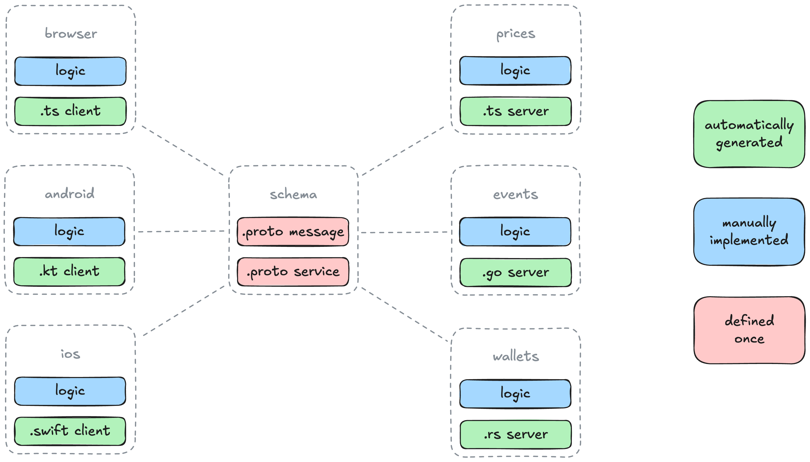

# pulsarprotos

This is the API schema for the Pulsar RPC. The schema here describes how RPC
calls are shaped and function using [Protocol Buffer] definitions. Having a
unified abstraction helps us to generate client and server code across different
languages so that we remain mostly independent of transport layer specifics.



### Transfers

Pulsar allows to search for paginated token transfers associated to the
specified wallet addresses.

```json
{
  "filter": {
    "paging": {
      "kind": "page",
      "start": "0",
      "stop": "49"
    }
  },
  "search": [
    {
      "address": "0x4838...5f97"
    }
  ]
}
```

```json
{
  "result": [
    {
      "address": "0x4838...5f97",
      "transfers": [
        {
          "amount": "420000000000000000000",
          "created_at": "1689001255",
          "id": "a9526eca-953e-49f7-aa4c-12fc06132124",
          "to": "0x4838...5f97"
        }
      ]
    }
  ]
}
```

### Limitations

All RPCs implement a hard limit on the maximum amount of actions that can be
processed within the same request. Specifically no more than 100 actions can be
received on any given endpoint in a single call. Further note that the hard cap
of returned objects is 1000. No more than 1000 objects can be received from any
endpoint in a single call.

### Pagination

Pagination works by providing paging pointers for search query objects. The
pointers `start` and `stop` are always **inclusive**. In the request example
below the response would contain the first batch of 50 items. Depending on the
requested resources, consecutive calls with the exact same pointers may not
result in the same objects received, given the dynamic nature of the underlying
system.

```json
{
  "filter": {
    "paging": {
      "kind": "page",
      "start": "0",
      "stop": "49"
    }
  }
}
```

Providing paging pointers in requests containing multiple search query objects
causes the system to apply paging to each search query result. Consider
resources to be searched from two lists using two search query objects. Say the
lists look like [A B C D] and [E F G H]. Searching for both results from both
lists in a single call using `start=0` and `stop=1` would return [A B] and [E
F]. If paging is desired for large lists of objects, single search query objects
may be more applicable, depending on the use case.

There is only one kind of paging pointer supported at the moment, `kind=page`.
Kind "page" is the default and does not have to be provided. Using kind "page"
may result in less received objects than requested, but never more.

### Development

Merging changes into the `main` branch triggers several Github Actions to auto
generate code for different programming languages. Once the package that you are
interested in is synchronized, you can import your updated dependency.

- `.github/workflows/pbf-go.yaml` updates https://github.com/0xSplits/pulsargocode
- `.github/workflows/pbf-ts.yaml` updates https://github.com/0xSplits/pulsartscode

### Formatting

You need to install the Clang Formatter on your system in order to format the
`.proto` files properly. If you are using VS Code you can also install the [VS
Code Extension] and format files on save.

```bash
brew install clang-format
```

```bash
clang-format -i $(find ./pbf -name "*.proto")
```

[Protocol Buffer]: https://protobuf.dev
[VS Code Extension]: https://marketplace.visualstudio.com/items?itemName=xaver.clang-format
